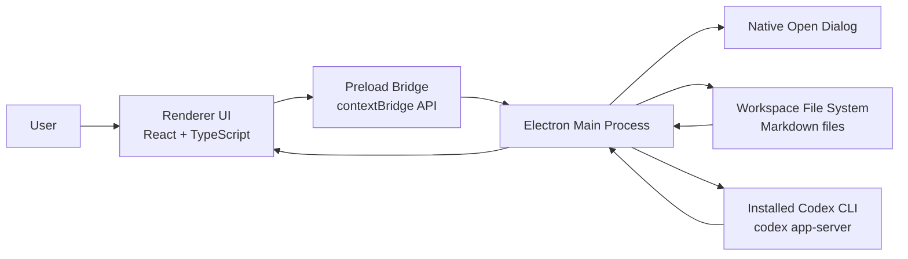

# Mohio Architecture

This document defines Mohio's current system boundary and data flow.

## Current Boundary

- Single desktop application in `desktop/`
- Two Obsidian plugins in `obsidian/` (scaffold only, not yet implemented):
  - `obsidian/ai-assistance/` — AI assistance panel backed by the locally installed `codex` CLI
  - `obsidian/git-sync/` — Git-backed snapshot history, manual publish sync, and incoming-change conflict guidance
- Local-first workspace model
- No backend service
- No user account system
- No external authentication flow
- Codex-backed assistant integration through the locally installed `codex` CLI and Codex app-server session store

## System Diagram

## Runtime Areas

- `Electron main`: window, menu, folder picker, filesystem access, file watching, Codex app-server client
- `Preload`: typed `window.mohio` bridge
- `Renderer`: React UI for workspace tree, search, single-document editor surface, assistant history, and transcript
- `Workspace`: local folder with `.md`, `.markdown`, and `.mdx` files

## Data Flow

### Open Folder

1. User opens a folder from the workspace button or `File > Open Folder...`.
2. Main opens the native directory picker.
3. Main builds a `WorkspaceSummary`.
4. Renderer refreshes the workspace tree and selects the first available document.

### Open Document

1. Renderer sends a `relativePath` through the preload API.
2. Main resolves that path inside the active workspace.
3. The Markdown file is read and parsed.
4. Renderer loads the parsed title and body into the editor.

### Search Discovery

1. User types in the left-sidebar `Search` tab input.
2. Renderer sends the search query through preload.
3. Main scans workspace markdown files and builds discovery data on demand:
   - title/path/content matches for search
4. Renderer renders ranked search results and opens documents into the active editor surface.

### Save Document

1. Renderer debounces edits for `1000ms`.
2. Renderer sends `relativePath`, `title`, and `markdown`.
3. Main rebuilds the Markdown file with a normalized H1 title.
4. Main sanitizes the filename, renames the file if needed, and writes the result.
5. Renderer reloads workspace state and keeps the selection in sync.

### External File Change Handling

1. Renderer subscribes to file watching for the selected document.
2. Main watches that file path.
3. If the file changes on disk, main re-reads the workspace and document.
4. Renderer updates the open editor unless that would overwrite unsaved local edits.

### Assistant Conversation

1. Renderer loads Codex chat history for the current workspace through the preload API.
2. Renderer selects an existing Codex thread or creates a new one.
3. Renderer sends the user message plus the current document title, document path, and current document Markdown to main.
4. Main starts or resumes the Codex thread through `codex app-server`, always with the active workspace root as `cwd`.
5. Main reuses Codex's existing config, auth state, and session storage instead of persisting assistant history itself.
6. Main starts the turn, streams assistant deltas back to renderer through assistant events, and refreshes the workspace-filtered thread list when Codex thread state changes.
7. Renderer updates the right sidebar transcript and history list while the run is active.

### Internal Link Activation

1. User `Cmd/Ctrl+Click`s an internal link in the editor.
2. Renderer resolves target path (markdown/wiki/anchor forms) against current workspace documents.
3. Renderer opens the resolved document in the active editor surface.

## Security and Trust Boundaries

- The renderer runs with `contextIsolation: true`.
- `nodeIntegration` is disabled in the renderer.
- Native capabilities are only available through the preload API.
- Document reads and writes are restricted to the active workspace root through path resolution checks.
- Assistant runs execute from the workspace root, but Mohio starts Codex in read-only mode for this v1 integration.
- Mohio reuses Codex's own session and auth storage rather than copying assistant history into a Mohio-owned store.

## Third-Party Integrations

- `Electron` for desktop shell, menu, windowing, preload bridge, and IPC
- `React` for renderer composition
- `CodeMirror` for Markdown-source editing
- `yaml` for frontmatter parsing and serialization
- `lucide-react` for shared shell, assistant, and editor toolbar icons (source set: [lucide.dev/icons](https://lucide.dev/icons/); no custom SVG icon drawings)
- `codex` CLI and `codex app-server` for assistant conversations and session history

## Current Architectural Constraints

- The app is single-window and desktop-only today.
- Search discovery is computed from workspace files on demand, without persistent indexing.
- Assistant history browsing is limited to Codex threads whose `cwd` exactly matches the open workspace path.
- The assistant can chat about the workspace, but it cannot apply edits through Mohio yet.
- History is commit-list based (message/date/stats) rather than a visual side-by-side diff/restore workflow.
- Publish and sync currently target Markdown documents only (`.md`, `.markdown`, `.mdx`).
- There is no rendered preview mode for Markdown yet.

## When To Update This Document

Update this file when any of the following change:

- process boundaries
- preload or IPC contracts
- file-system ownership rules
- third-party service integrations
- top-level runtime architecture
