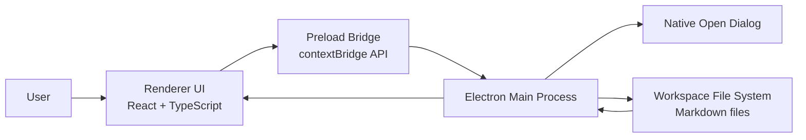

# Mohio Architecture

This document defines Mohio's current system boundary and data flow.

## Current Boundary

- Single desktop application in `desktop/`
- Local-first workspace model
- No backend service
- No user account system
- No external authentication flow
- No live assistant integration yet

## System Diagram

## Runtime Areas

- `Electron main`: window, menu, folder picker, filesystem access, file watching
- `Preload`: typed `window.mohio` bridge
- `Renderer`: React UI for workspace tree and editor
- `Workspace`: local folder with `.md`, `.markdown`, and `.mdx` files

## Data Flow

### Open Workspace

1. User opens a folder from the workspace button or `File > Open Workspace...`.
2. Main opens the native directory picker.
3. Main builds a `WorkspaceSummary`.
4. Renderer refreshes the workspace tree and selects the first available document.

### Open Document

1. Renderer sends a `relativePath` through the preload API.
2. Main resolves that path inside the active workspace.
3. The Markdown file is read and parsed.
4. Renderer loads the parsed title and body into the editor.

### Save Document

1. Renderer debounces edits for `1000ms`.
2. Renderer sends `relativePath`, `title`, and `markdown`.
3. Main rebuilds the Markdown file with a normalized H1 title.
4. Main sanitizes the filename, renames the file if needed, and writes the result.
5. Renderer reloads workspace state and keeps the selection in sync.

### External File Change Handling

1. Renderer subscribes to file watching for the selected document.
2. Main watches that file path.
3. If the file changes on disk, main re-reads the workspace and document.
4. Renderer updates the open editor unless that would overwrite unsaved local edits.

## Security and Trust Boundaries

- The renderer runs with `contextIsolation: true`.
- `nodeIntegration` is disabled in the renderer.
- Native capabilities are only available through the preload API.
- Document reads and writes are restricted to the active workspace root through path resolution checks.

## Third-Party Integrations

- `Electron` for desktop shell, menu, windowing, preload bridge, and IPC
- `React` for renderer composition
- `Quill` for rich-text editing
- `marked` and `turndown` for Markdown-to-editor conversion and editor-to-Markdown conversion
- `yaml` for frontmatter parsing and serialization
- `lucide-react` for editor toolbar icons

## Current Architectural Constraints

- The app is single-window and desktop-only today.
- Search UI exists as a placeholder input only; it is not wired to workspace querying.
- The assistant sidebar is present as layout scaffolding only.
- Note creation, rename UI, delete UI, publish flow, checkpoints, and source mode are not implemented yet in the renderer.
- Task lists and tables are preserved in rich-text mode but are not fully editable yet.

## When To Update This Document

Update this file when any of the following change:

- process boundaries
- preload or IPC contracts
- file-system ownership rules
- third-party service integrations
- top-level runtime architecture
